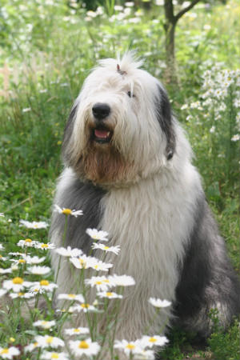

# Andrey Caballero

Profesor del Instituto Tecnológico de Costa Rica



## Cursos impartidos

- Laboratorio de Emisiones Atmosféricas
- Protección Ambiental

````
Experiencia profesional

````

[Proyecto de investigación](https://www.tec.ac.cr)

## Áreas de interés

**Gestión del recurso hídrico**  
**Modelación ambiental**  
**Gestión Ambiental**  
**Producción más Limpia**
